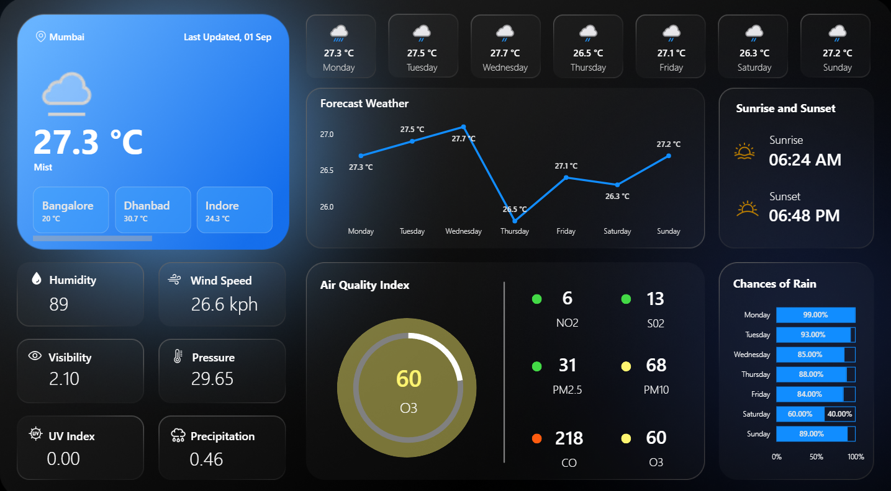

# 🌦️ Weather Dashboard | Power BI

An interactive **Power BI Weather Dashboard** that visualizes real-time weather conditions, 7-day forecasts, air quality, and environmental metrics for multiple cities. The dashboard provides an intuitive and visually appealing interface for monitoring weather trends and making data-driven decisions.

---

## 📸 Dashboard Preview

---

## 📌 Project Overview

This dashboard integrates weather data into an interactive Power BI report, allowing users to:

- View current weather conditions
- Monitor weekly temperature forecasts
- Analyze air quality metrics
- Compare weather across multiple cities
- Track key environmental indicators
- Visualize weather trends through interactive charts

---

## ✨ Features

### 🌍 Current Weather
- Current Temperature
- Weather Condition
- Last Updated Date
- Multi-city Weather Selection

### 📅 Weather Forecast
- 7-Day Forecast
- Temperature Trend Line Chart
- Daily Weather Cards

### 🌅 Environmental Metrics
- Humidity
- Wind Speed
- Visibility
- Atmospheric Pressure
- UV Index
- Precipitation

### 🌫️ Air Quality Monitoring
- Air Quality Index (AQI)
- PM2.5
- PM10
- NO₂
- SO₂
- CO
- O₃

### ☔ Additional Insights
- Sunrise Time
- Sunset Time
- Daily Rain Probability
- Interactive KPI Cards

---

## 🛠️ Tech Stack

- **Power BI Desktop**
- **Power Query**
- **DAX**
- **Weather API**
- **Data Modeling**
- **Interactive Visualizations**

---

## 📊 Dashboard Components

| Component | Description |
|----------|-------------|
| Current Weather | Displays live weather conditions |
| Temperature Forecast | 7-day forecast with trend chart |
| Air Quality | AQI gauge with pollutant indicators |
| Weather Metrics | Humidity, Wind Speed, Visibility, Pressure |
| Rain Analysis | Daily chance of rainfall |
| Sunrise & Sunset | Daily sunrise and sunset timings |
| City Selection | Compare weather across multiple cities |

---

## 📈 Key Insights

- Compare weather conditions across cities
- Monitor weekly temperature variations
- Analyze air quality levels
- Track precipitation probability
- Observe environmental trends
- View daily sunrise and sunset timings

---

## 🧠 Power BI Concepts Used

- Power Query (ETL)
- Data Cleaning
- Data Transformation
- Data Modeling
- Relationships
- DAX Measures
- KPI Cards
- Gauge Charts
- Line Charts
- Bar Charts
- Slicers
- Interactive Filters
- Custom Dashboard Design

---

## 📚 Skills Demonstrated

- Data Visualization
- Dashboard Development
- Business Intelligence
- Power BI
- DAX
- Power Query
- Data Modeling
- ETL
- Data Analytics
- API Integration
---

